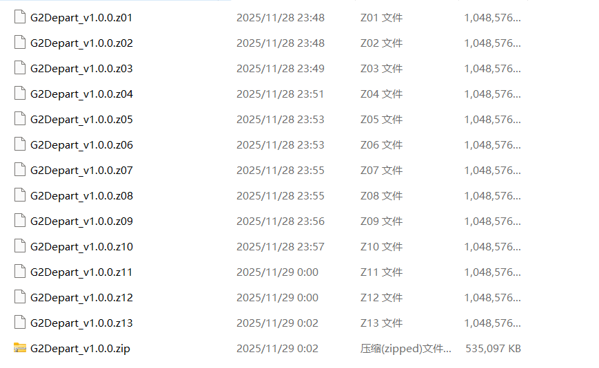

## 01. 前置需求

 - 一台搭载 Windows 操作系统的电脑。
 - 常见解压软件（WinRAR、Bandizip等）

### 注意

包括但不限于以下设备暂无安装游玩支持：
 - 非 Windows 操作系统 PC
 - 游戏主机
 - <i>**智能手机、按键手机等**</i>

您可以尝试鼓捣在这些非支持平台上游玩，但我们无法提供支持。

## 02. 下载游戏

前往 [网站首页](https://aya.moeqy.com/) 或者 [官方宣传PV](https://www.bilibili.com/video/BV13JSuBNE2S) 的评论区中选择您合适的下载方式进行下载。

下载前请尽可能确保您的电脑硬盘存储空间至少有30GB的剩余空间。

### 什么是电脑硬盘存储空间？

在开始菜单或者您的桌面点击此电脑，您可以看到在您电脑中所有磁盘的容量大小。

## 02. 解压下载完毕的压缩包

《射命丸文的寂静的故乡》采用分卷压缩包的形式解压安装。

下载完毕后打开下载的 `G2_v1.0.0` 文件夹，您将看见以下压缩文件：

*图 1: 压缩文件*

标有 `z01`、`z02` 等文件均为压缩包的**分卷**，而标记了 `zip` 格式的文件才是我们需要点击操作的压缩包本体。通过右键并选择您拥有的压缩文件解压。

## 03. 启动游戏

打开解压完成后的游戏文件夹 `G2Depart_v1.0.0` ，双击 `G2_depart.exe` 即可开始游戏。